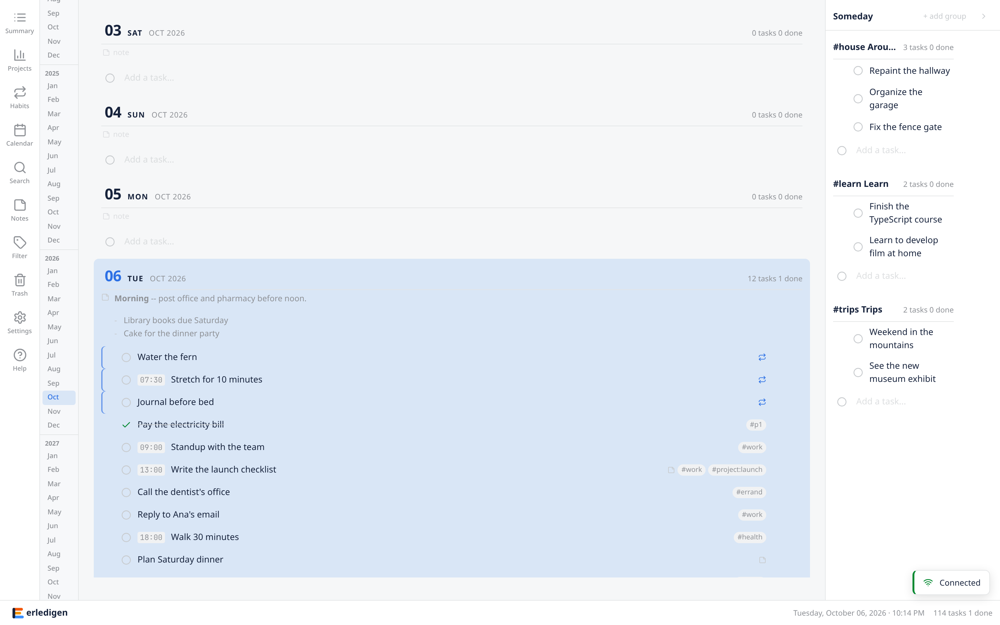

# Erledigen

Erledigen is an **automated paper calendar**: a day list you write by hand,
plus an engine that fills in everything that recurs and never moves your
handwriting. "Erledigen" is German for "to get done".

The daily list is the execution surface. The Someday panel is the capture
net. Habits generate their instances into the daily list on their own
schedule. Everything is organized with tags -- the same tags work across
tasks, lists, and filters, and there is nothing else to configure.

No accounts, no analytics, no telemetry. Your data lives in your own
SQLite database, synced live to every open window over WebSocket.

[](https://github.com/funkybooboo/erledigen/actions/workflows/ci.yml)
[](./LICENSE)



## Key features

*   **A scrolling daily list** -- the primary working area. Days stack and load
    as you scroll, with inline add/edit and a month minimap for orientation.
*   **A Someday panel** -- a capture net for unscheduled work, organized into
    tag-based lists you create yourself; drag-to-resize and collapsible
    (`Cmd/Ctrl+\`).
*   **Habits that fill themselves in** -- type "water plants every friday at
    9am" once, in any add input or the Habits modal; instances appear on their
    schedule with streaks and a completion heatmap.
*   **Notes that render as you write** -- task titles, task notes, and each
    day's margin note are live markdown: only the line under your cursor shows
    raw syntax, everything else renders.
*   **Tags are the whole organizational system** -- `#p1`/`#p2`/`#p3`
    priority, `project:`-prefixed project tags, and any free-form tag; one
    filter covers everything.
*   **Keyboard-first** -- every action has a key (vim-style navigation,
    `g`-sequences for modals, priority keys `1`/`2`/`3`/`0`, `Cmd/Ctrl+Z`
    undo); hover anything to see its binding.
*   **Live sync, your data** -- every mutation broadcasts to every connected
    client instantly; a canonical JSON snapshot of everything can be exported
    and restored on a fresh instance.

Also: sub-tasks with completion roll-up, holidays with `.ics` import,
soft-delete trash with undo, and import from Todoist, Things 3, CSV, and
iCal. The [user docs](./docs/use/README.md) cover all of it.

## Quick start

This project uses [mise](https://mise.jdx.dev) as its task runner and tool
version manager. Install it first, then:

```bash
mise run install   # dependencies
mise run dev      # docker dev stack: client on :3000, server on :4000
```

### Common tasks

| Command | What it does |
|---------|--------------|
| `mise run dev` | Start the docker dev stack (server + client) |
| `mise run prod` / `prod-stop` | Build + start / stop the docker prod stack |
| `mise run dev-refresh` | Rebuild dev images after changing dependencies |
| `mise run nuke-db` | Permanently delete the dev or prod database volume |
| `mise run lint` / `format` | Biome lint / format (auto-fix) |
| `mise run type-check` | Type-check all packages |
| `mise run test` | Run all unit tests in a container |
| `mise run test-e2e` | Playwright e2e + api tests in the docker test stack |
| `mise run build` | Build all packages + client bundle-size budget |
| `mise run ci` | Full local CI mirror |
| `mise run doctor` | Pre-flight environment check |
| `mise run release` | Cut a release: gates + version bump + PR + tag |

App-running tasks (dev, prod, tests) execute in containers and never touch
your host environment. The [full task list](./docs/build/process/getting-started.md)
lives in the developer docs.

## Docker

One multi-stage `Dockerfile` at the repo root; compose picks the stage via
`build.target`:

| Stage | Used by | What it is |
|-------|---------|------------|
| `development` | dev stack, test services | bun + workspace deps + source |
| `production-server` | prod stack | minimal bun runtime + server bundle |
| `production-client` | prod stack | node runtime + SvelteKit adapter-node build |
| `e2e` | e2e runner (test stack) | mcr.microsoft.com/playwright + bun + source |

**Dev** (`compose.yaml`): source is bind-mounted, so code edits are picked
up live -- no rebuild needed. The dev DB lives in the `dev-data` named
volume, never in the repo.

**Prod** (`compose.prod.yaml`): built artifacts only, behind a Caddy
reverse proxy on a single port (default 8080). Client and API are
same-origin by default; pass an absolute `VITE_API_URL` build arg for a
split-origin deployment.

**Tests** (`compose.test.yaml`): fully self-contained -- no bind mounts, no
published ports, `STORAGE_ADAPTER=memory`, Chromium bundled in the runner
image.

Version pins to keep in sync: `BUN_VERSION` in the `Dockerfile` must match
`[tools] bun` in `mise.toml`; `PLAYWRIGHT_VERSION` must match the
`@playwright/test` version in `bun.lock`.

## Layout

```
erledigen/
|-- packages/
|   |-- client/   # SvelteKit frontend (scoped CSS, Svelte 5 runes)
|   |-- server/   # Bun REST API + WebSocket server
|   \-- shared/   # Types, adapter interfaces, constants, universal utilities
|-- docs/         # User + developer documentation, ADRs
|-- tests/        # Playwright e2e + api suites
|-- tools/        # Build, test, release, and maintenance scripts
|-- deploy/       # Caddy edge proxy for the prod stack
|-- plans/        # Roadmap and planning docs
\-- package.json
```

Client and server both talk to `@erledigen/shared` -- the same Zod-driven
types and the same adapter interfaces, so the API contract cannot drift
between the two sides. Testing: Bun unit tests, Playwright e2e + api,
Storybook for components; Biome for lint and format.

## Learn more

*   [User docs](./docs/use/README.md) -- introduction, design, notes, import/export
*   [Architecture](./docs/build/architecture/architecture.md) -- how the app is built
*   [Getting started](./docs/build/process/getting-started.md) -- setup and every task
*   [Code standards](./docs/build/standards/code-standards.md) -- how the code is written
*   [Testing](./docs/build/standards/testing.md) -- the three test layers
*   [Git workflow](./docs/build/standards/git-workflow.md) -- worktrees, PRs, commits
*   [Roadmap](./plans/roadmap.md) -- release-by-release development plan

## Contribute

This is a personal project, published openly -- you are welcome to hack on
it. Start with [CONTRIBUTING.md](./CONTRIBUTING.md), then the
[getting started guide](./docs/build/process/getting-started.md).

## License

Erledigen is released under the [AGPL-3.0-only license](./LICENSE)
(ADR-016). Found a
security issue? See [SECURITY.md](./SECURITY.md).